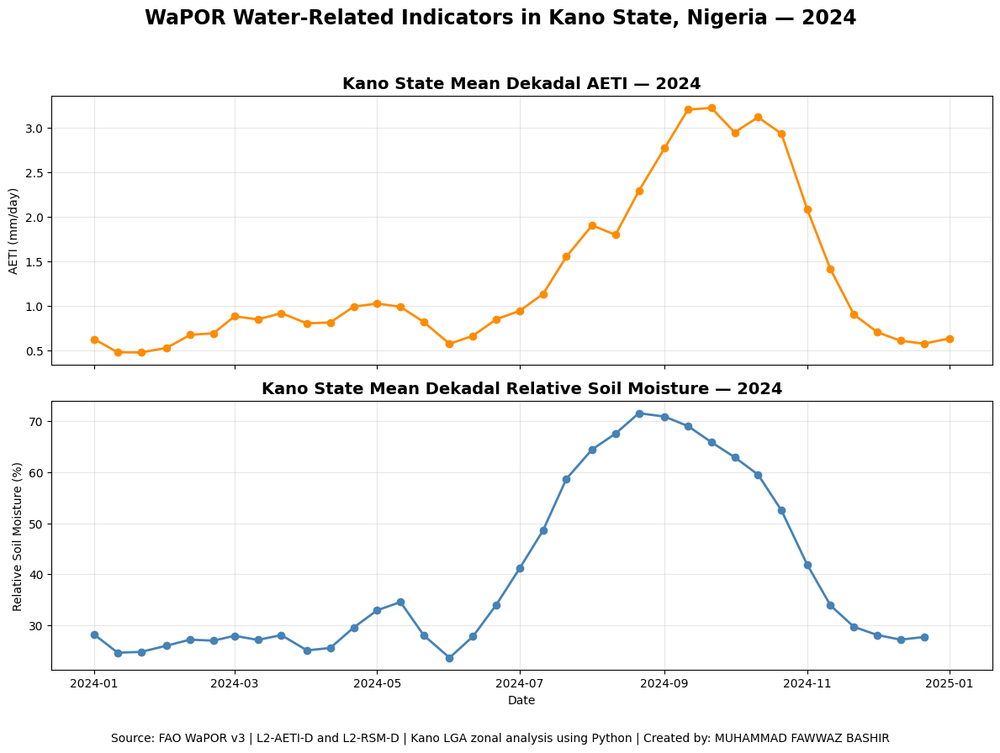
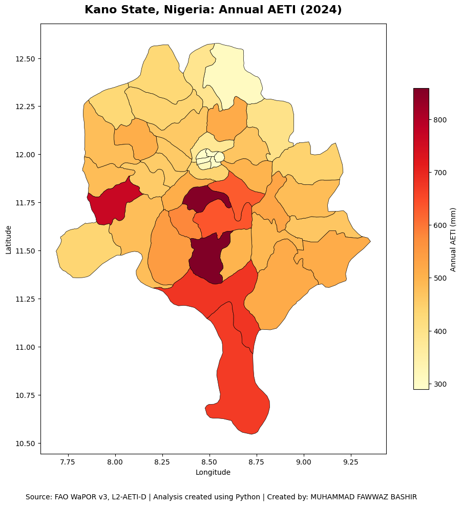
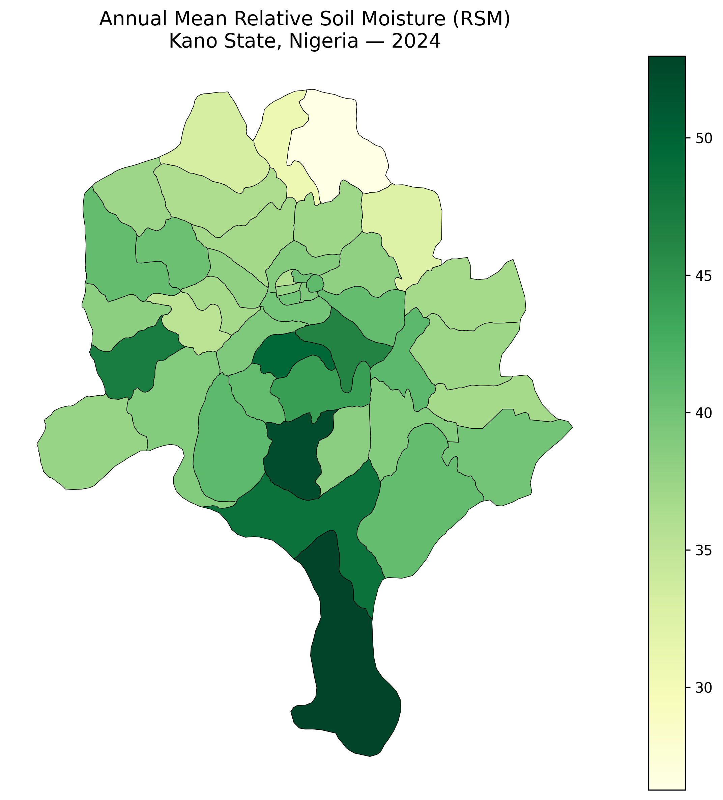

# Kano WaPOR Agricultural Water Analysis

**Author:** Muhammad Fawwaz Bashir  
**Study Area:** Kano State, Nigeria  
**Year:** 2024  
**Tools:** Python, GeoPandas, Rasterio, Pandas, Matplotlib, FAO WaPOR 3

---

## Project Overview

This project demonstrates a Python-based geospatial analysis of agricultural water-use indicators from the FAO WaPOR 3 dataset for Kano State, Nigeria.

The analysis was conducted at the Local Government Area (LGA) level and covers all 44 LGAs of Kano State.

Two WaPOR indicators were analyzed:

- Actual Evapotranspiration and Interception (AETI)
- Relative Soil Moisture (RSM)

The objective was to develop a reproducible workflow for downloading, processing, extracting, analyzing, and visualizing satellite-derived agricultural water indicators using Python.

## Study Area

Kano State is located in northern Nigeria and is an important agricultural region.

The analysis uses the administrative boundaries of the 44 LGAs within Kano State and summarizes WaPOR raster data spatially for each LGA.

## Data Sources

The project uses FAO WaPOR 3 data accessed programmatically using the `wapordl` Python package.

### AETI

**Variable:** `L2-AETI-D`

Actual Evapotranspiration and Interception measures the amount of water transferred from the land surface to the atmosphere through evapotranspiration and interception.

- Temporal coverage: 2024
- Spatial analysis: LGA-level zonal statistics
- Output: annual AETI in mm/year

### Relative Soil Moisture

**Variable:** `L2-RSM-D`

Relative Soil Moisture provides an indicator of soil moisture conditions.

- Temporal coverage: 2024
- Spatial analysis: LGA-level zonal statistics
- Output: annual mean relative soil moisture (%)

## Methodology

1. Define Kano State as the study area.
2. Load the Kano State and LGA boundary datasets.
3. Download WaPOR 3 raster datasets using Python.
4. Check raster metadata, CRS, dimensions, nodata values, and temporal bands.
5. Extract zonal statistics for each LGA.
6. Organize observations into Pandas DataFrames.
7. Calculate annual LGA-level averages.
8. Join the results with the LGA geometries.
9. Create thematic maps and graphs using Python.
10. Export results as CSV and GeoPackage files.

## Results

### Seasonal Trends (Dekadal Analysis)

The project tracks agricultural water changes throughout the year using 10-day (dekadal) averages. The analysis highlights distinct seasonal patterns, showing that both water usage (AETI) and soil moisture rise sharply during the rainy season between July and October, peaking in August and September.



### AETI

The 2024 AETI analysis produced annual results for all 44 LGAs.

- Minimum: 289.1 mm/year
- Maximum: 858.3 mm/year
- Mean: 486.2 mm/year

### AETI Map



### Relative Soil Moisture

The RSM analysis produced 36 observations for each of the 44 LGAs during 2024.

The annual mean RSM across the study area was approximately **39.6%**.

LGA-level annual mean RSM values ranged approximately from **26.3% to 53.0%**.

### RSM Map



## Example Results

| LGA | Annual Mean RSM (%) |
|---|---:|
| Ajingi | 36.76 |
| Albasu | 36.76 |
| Bagwai | 40.38 |
| Bebeji | 41.25 |
| Bichi | 36.27 |

## Project Structure

```text
data/
├── raw/
└── processed/

outputs/
└── figures/

src/
└── kano_wapor_analysis.py

README.md
.gitignore
```

## Technologies and Skills

- Python
- Pandas
- NumPy
- GeoPandas
- Rasterio
- Matplotlib
- Raster data processing
- Vector data processing
- Zonal statistics
- Geospatial analysis
- Coordinate reference systems
- Agricultural water analysis
- Thematic mapping
- Git and GitHub

## Reproducibility

The main analysis workflow is available in:

`src/kano_wapor_analysis.py`

Processed datasets are available in `data/processed/` and maps are available in `outputs/figures/`.

## Limitations

This analysis summarizes raster information at the LGA level. LGA-level averages can hide substantial variation within individual LGAs. The results should therefore be interpreted as spatial summaries rather than field-level measurements.

## Author

**Muhammad Fawwaz Bashir**

Geospatial Data Analysis | Python | Remote Sensing | Agricultural Water Analysis
